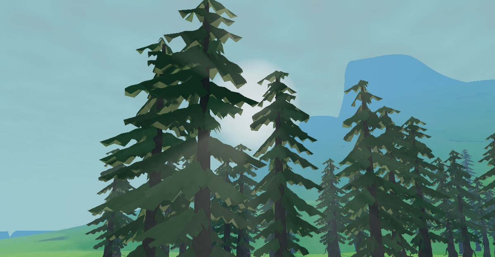

# URP Directional Volumetric Lighting
 
 
 Directional volumetric post process for Unity URP

## Using this package:
 Add the Volumetric lighting render feature to your forward renderer asset
 Script will use the light set as the sun in render settings as the main light
 